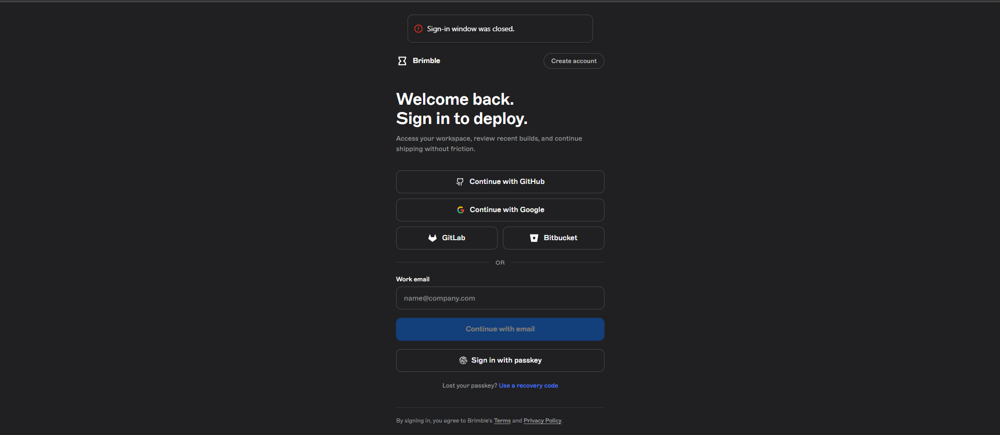
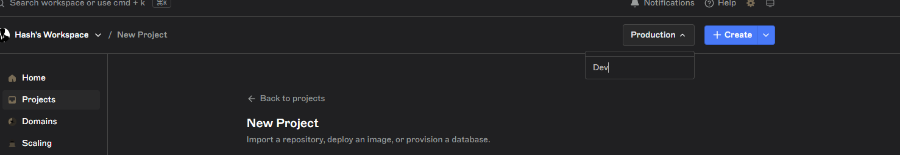

# Brimble Deploy Experience & Feedback

I attempted to deploy a simple Node.js app on the Brimble platform. Below is an honest account of the issues I ran into. I was unable to complete a deployment due to multiple blocking bugs.

---

## 1. Google Sign-Up — Confusing Tab Flow

After signing up with Google, the OAuth popup displayed a "close this tab" message. I closed the tab as instructed, but this also closed the sign-up page instead of redirecting me back. The page then showed an error saying the sign-up page was closed. I had to manually reload the page to get back to a working state.

## 2. GitHub Import — "Service Unavailable" Error

On the new project page, under "How would you like to deploy?", clicking **Import from GitHub** immediately showed a "Service Unavailable" error popup. The **Connect to GitHub** button was still active and clickable despite the error.

## 3. GitHub Auth — Error After Redirect

After clicking **Connect to GitHub**, I was redirected to GitHub's OAuth page. I completed the authorisation flow and was redirected back to Brimble. After spinning for a while, the page showed an error popup.

## 4. Create Environment — Broken Modal Loop

The "Create Environment" feature did not work. When I clicked **Create**, the button showed a loading spinner briefly, then nothing happened. After pressing Enter to submit, instead of creating the environment, it opened another "Create New Environment" modal on top — an infinite loop of modals without ever completing the action.

## 5. Blocked From Deploying

Because none of the above flows completed successfully (GitHub import errored, environment creation was broken), I was unable to deploy anything on the platform. This means I could not test the actual deployment pipeline, logs, domain routing, or any post-deploy features.

---

## Summary

The onboarding flow has several blocking issues that prevent a new user from completing their first deployment. The core friction points are:

- **OAuth redirect confusion** 
- **GitHub integration service errors** — the integration appears to be down or unstable, with no fallback or retry.
- **Environment creation bug** — a modal loop prevents creating the required environment to deploy into.
